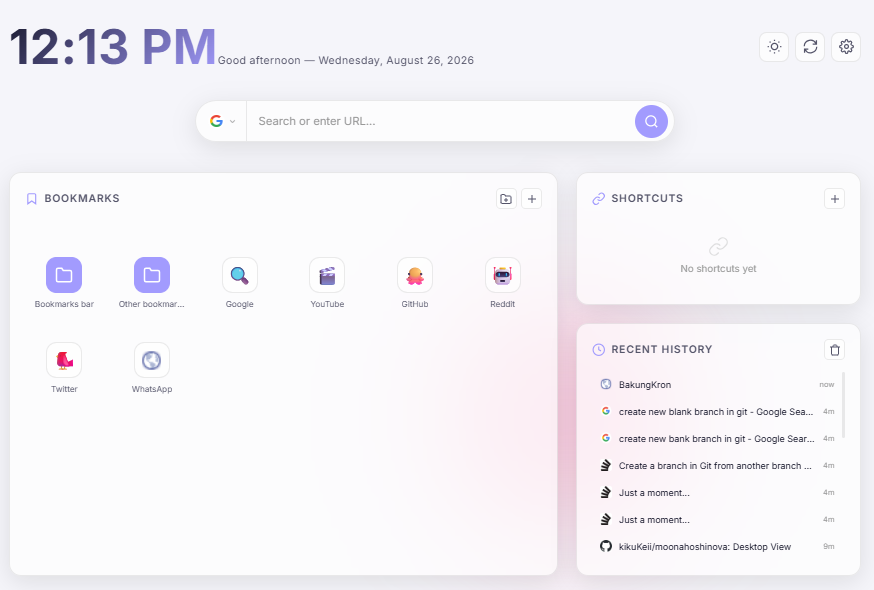
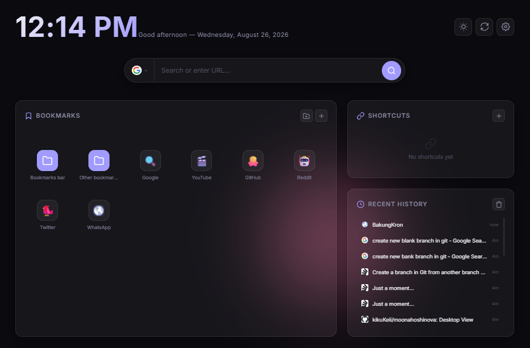
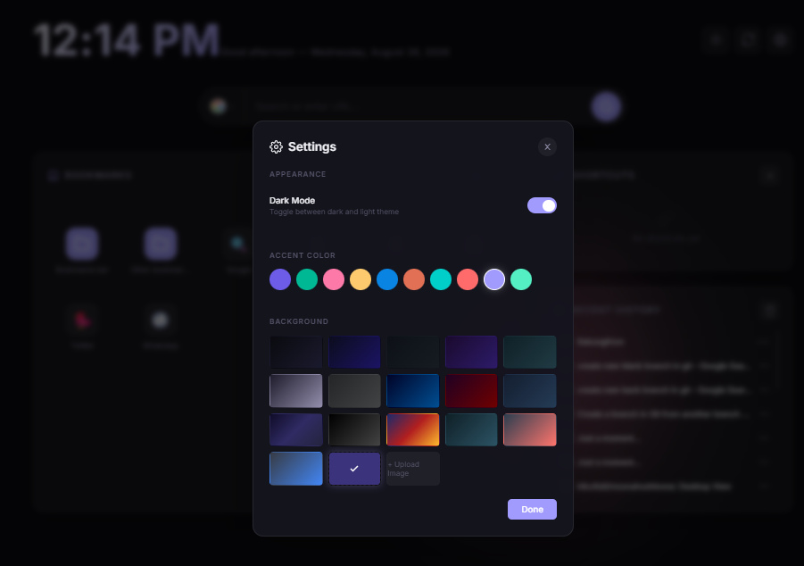
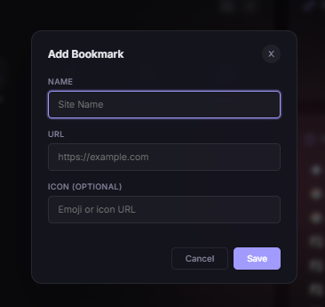
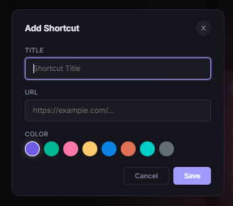
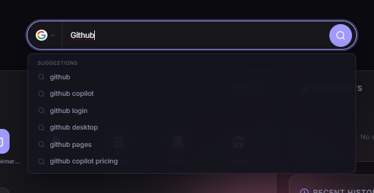
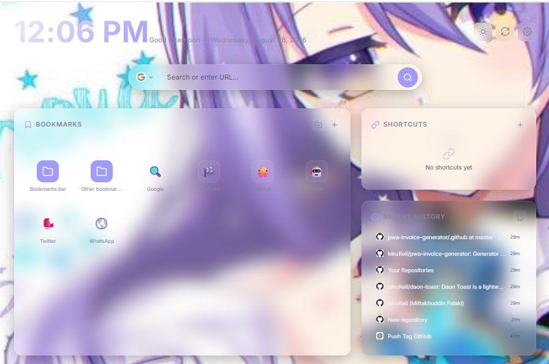
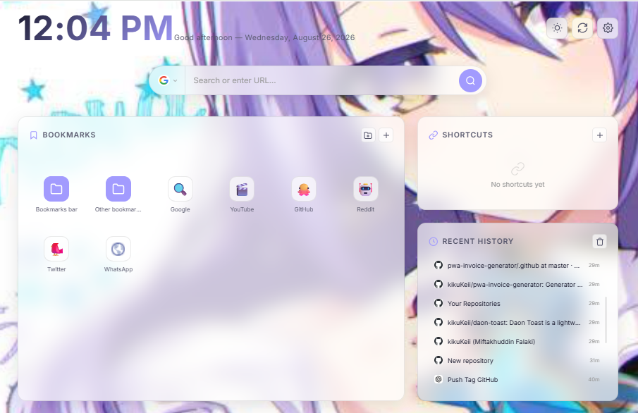

<div align="center">

# BakungKron

**Beautiful modern new tab page for Chrome**

[](https://github.com/kikukeii/BakungKron-extension)
[](https://developer.chrome.com/docs/extensions/mv3/)
[](LICENSE)
[](https://kikukeii.github.io/BakungKron-extension/)

</div>

---

## Features

- **Search Engine Selector** — Choose between Google, Bing, DuckDuckGo, YouTube, GitHub, Wikipedia, Reddit, Amazon with live suggestions
- **Bookmark Grid** — Auto-fetch from Chrome bookmarks with folder navigation
- **Shortcuts** — Create quick link shortcuts with custom colors
- **History** — View and clear recent browsing history
- **Customizable** — Dark/Light mode, 10 accent colors, 16+ background gradients, custom image upload
- **Clock & Greeting** — Time display with auto-greeting based on time of day
- **Search History** — Save and filter previous searches

## Screenshots

| Light Mode | Dark Mode |
|:----------:|:---------:|
|  |  |

| Theme Settings | Add Bookmark |
|:--------------:|:------------:|
|  |  |

| Add Shortcut | Search Engines |
|:------------:|:--------------:|
|  |  |

| Background (Dark) | Background (Light) |
|:-----------------:|:------------------:|
|  |  |

## Installation

### Download

Go to [Releases](https://github.com/kikukeii/BakungKron-extension/releases) and download the zip for your browser.

### Install (Extension Manager)

#### Chrome / Edge / Brave
1. Extract the zip file
2. Open browser → `chrome://extensions/`
3. Enable **Developer mode** (top right)
4. Click **Load unpacked**
5. Select the extracted folder
6. Open a new tab — BakungKron will appear

#### Firefox
1. Extract the zip file
2. Open `about:debugging#/runtime/this-firefox`
3. Click **Load Temporary Add-on**
4. Select any file inside the extracted folder
5. Open a new tab — BakungKron will appear

> **Note:** Firefox temporary addons disappear after browser restart. For permanent install, submit to [Firefox Add-ons](https://addons.mozilla.org/developers/addon/submit/).

#### Opera
1. Extract the zip file
2. Open `opera://extensions/`
3. Enable **Developer mode**
4. Click **Load unpacked**
5. Select the extracted folder
6. Open a new tab — BakungKron will appear

## Usage

| Action | How |
|--------|-----|
| Search | Type in search bar, pick engine from dropdown |
| Add Bookmark | Click `+` button in Bookmarks panel |
| Create Folder | Click folder icon next to `+` |
| Navigate Folder | Click a folder in the grid, use breadcrumb to go back |
| Add Shortcut | Click `+` in Shortcuts panel |
| Change Theme | Click sun/moon icon or open Settings |
| Change Background | Click refresh icon or open Settings |
| Clear History | Click trash icon in History panel |

## Tech Stack

- Chrome Extensions Manifest V3
- Vanilla HTML / CSS / JavaScript
- Chrome APIs: `bookmarks`, `history`
- Glassmorphism UI design

## Project Structure

```
BakungKron-extension/
├── manifest.json      # Extension manifest
├── newtab.html        # New tab page
├── styles.css         # All styles
├── script.js          # All logic
├── icons/
│   ├── icon16.png
│   ├── icon48.png
│   └── icon128.png
└── .gitignore
```

## Release

Push tag untuk trigger CI/CD dan otomatis build zip:

```bash
git tag v1.0.0
git push origin v1.0.0
```

GitHub Release akan dibuat dengan zip untuk semua browser, beserta commit log dan daftar contributor.

## Contributing

Contributions are welcome!

1. Fork the repo
2. Create your branch (`git checkout -b feature/amazing-feature`)
3. Commit your changes (`git commit -m 'Add amazing feature'`)
4. Push to the branch (`git push origin feature/amazing-feature`)
5. Open a Pull Request

## Author

**kikukeii** — [GitHub](https://github.com/kikukeii)

## License

MIT License. See [LICENSE](LICENSE) for details.
